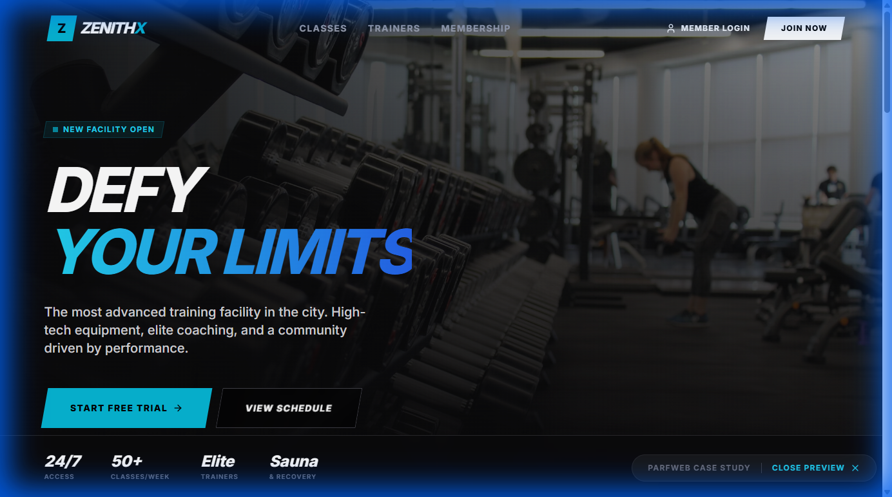

# Month 2: Authority & Growth (February 2026)

> [!IMPORTANT]
> **Strategy Shift**: Month 1 was "Hello". Month 2 is **"We are the Experts"**.
> **Start Date**: Monday, Feb 2nd.
> **Assets**: All images are ready to download in the "Visuals" section below.

## Week 1: The "Problem Solver" (Feb 2 - 6)
*Focus: You fix the headaches other agencies create.*

### 📅 Monday, Feb 2
**Topic**: The Maze (Simplification)
**Visual**: 
**Copy**:
Stop paying for "hosting complications."

Running a plumbing business is hard. Your website shouldn't be.
Most agencies give you a tangled mess of DNS records, hosting fees, and plugin updates.
We give you a straight line to revenue.
One fee. One call. Done.
#Simplification #NoHeadaches #SiteSpark

### 📅 Wednesday, Feb 4
**Topic**: Speed & Efficiency
**Visual**: 
**Copy**:
Time is money. We save both.

In the time it takes other agencies to "send a proposal," we launch your site.
7 Days. That's our standard.
Because every day you wait is a lead your competitor gets.
#SpeedRun #7DayBuild #Efficiency

### 📅 Friday, Feb 6
**Topic**: Technical Superiority
**Visual**: 
**Copy**:
Is your website losing 50% of your leads?

If your site takes 5 seconds to load, half your customers just clicked "Back."
Check the difference.
old: Slow, Cluttered, Confusing.
SiteSpark: Instant, Clean, Converting.
Upgrade your engine.
#WebSpeed #ConversionRate #Tech

---

## Week 2: Niche Dominance (Feb 9 - 13)
*Focus: You know the Trades better than anyone.*

### 📅 Monday, Feb 9
**Topic**: Mobile Reality
**Visual**: 
**Copy**:
Built for the job site, not the desk.

Your customers aren't sitting at iMacs. They are searching for "Emergency Electrician" on a cracked iPhone screen while standing in a flooded basement.
If your buttons aren't HUGE and your text clear, you lost them.
We build for the field.
#MobileFirst #Tradesman #ConstructionMarketing

### 📅 Wednesday, Feb 11
**Topic**: The Knowledge Flex
**Visual**: 
**Copy**:
What we actually do (in 4 points).

1. Trades Only.
2. 7-Day Sprint.
3. Mobile First.
4. $500 Start.
We don't do "everything for everyone." We do one thing perfectly for YOU.
#Specialist #NicheAgency #Expertise

### 📅 Friday, Feb 13
**Topic**: Social Proof
**Visual**: 
**Headline**: Results look like this.
**Copy**:
Results look like this.

Clean lines. bold calls to action. Zero fluff.
This is what a lead-generating asset looks like.
Does your current site measure up?
DM "AUDIT" for a free honest review.
#Portfolio #WebDesign #Results

---

## Week 3: The Process (Feb 16 - 20)
*Focus: Removing fear of the unknown.*

### 📅 Monday, Feb 16
**Topic**: The Roadmap
**Visual**: 
**Copy**:
How it works (No mysteries).

Most clients fear the "black box" of web design.
Here is exactly what happens when you sign up:
Audit -> Design -> Build -> Launch.
No hidden steps. No surprise fees. Just a chain of results.
#Transparency #Process #WebDev

### 📅 Wednesday, Feb 18
**Topic**: Growth Mindset
**Visual**: 
**Copy**:
Up implies Good.

A website isn't a digital brochure. It's a sales employee that never sleeps.
If your graph doesn't look like this, your website is broken.
Let's fix the trend line.
#Growth #SalesGraph #Business

### 📅 Friday, Feb 20
**Topic**: Success State
**Visual**: 
**Copy**:
The only notification that matters.

"New Appointment Request."
That's the only metric we care about.
We build sites to fill your calendar, not just your browser history.
Ready to be fully booked?
#FunnyBooked #ServiceBusiness #Leads

---

## Week 4: The Close (Feb 23 - 27)
*Focus: Scarcity and Monthly Offer.*

### 📅 Monday, Feb 23
**Topic**: The "Why Wait"
**Visual**: 
**Headline**: February is almost over.
**Copy**:
February is almost over.

You promised yourself "More Leads" in 2026.
Two months are gone.
Stop thinking. Start building. $500 gets you in the game.

### 📅 Friday, Feb 27
**Topic**: Final Call
**Visual**: 
**Copy**:
March is coming.

Who wants to dominate Spring Season?
We have 2 spots left for the "7-Day Sprint" starting Monday.
Claim yours.
